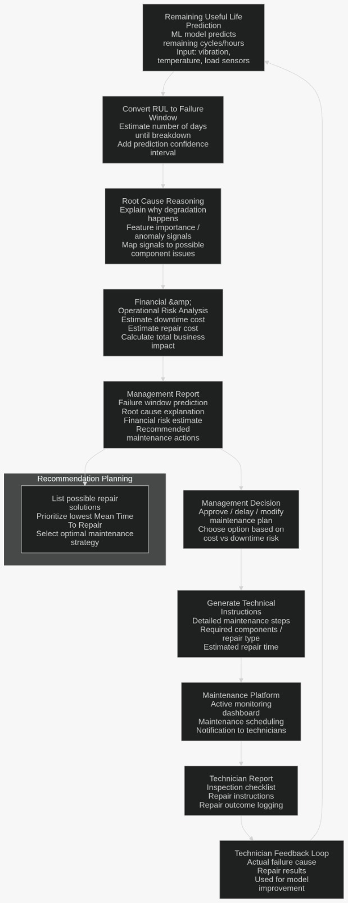
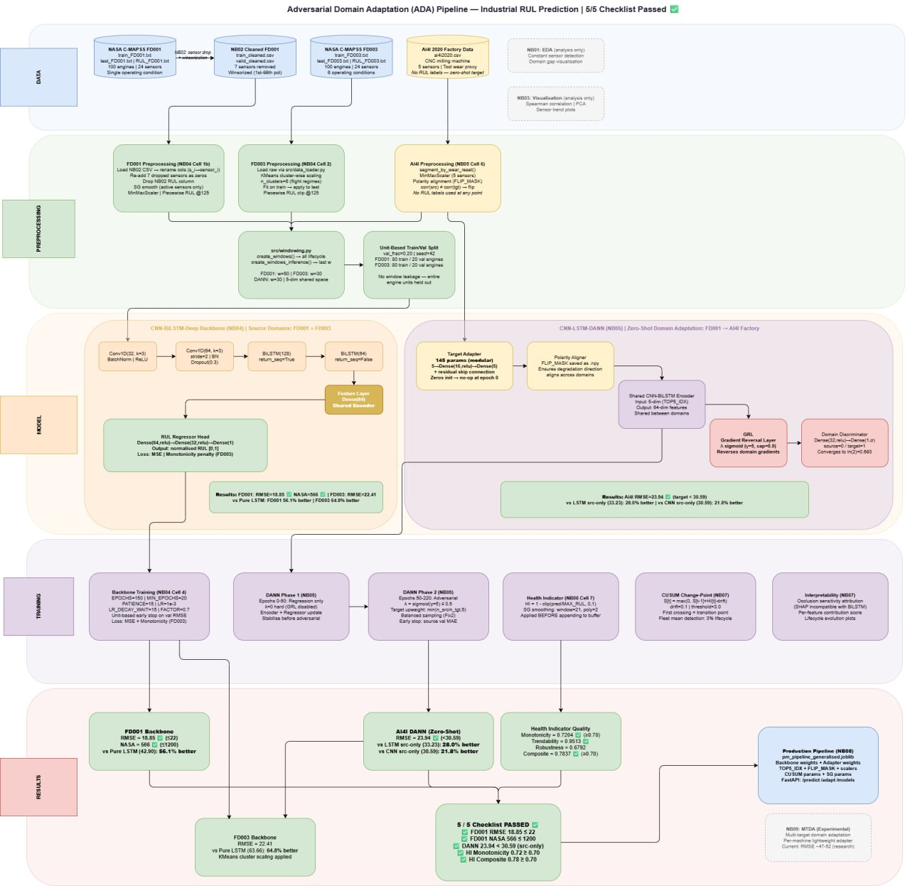

# Predictive Maintenance Platform (NASA C-MAPSS + VHACK Product)

This project is built to be **auditable by judges**: every major modeling choice is demonstrated in notebooks, metrics are reported from saved outputs, and deployment artifacts are explicitly linked to backend/frontend usage.

## Executive Summary

- Problem: Predict Remaining Useful Life (RUL) and machine health state for industrial assets.
- Approach: Sequence modeling (LSTM / CNN-BiLSTM), domain adaptation (DANN), and explainability.
- Evidence: Notebook-driven experiments with exported artifacts used directly by APIs and apps.
- Productization: `api/` for serving and `vhack/` for backend + frontend user workflows.

---

## 1) System Architecture

```text
Raw data (data/raw) + external target data (AI4I)
            │
            ▼
Notebook pipeline (notebooks/01..09) + core modules (src/)
            │  - preprocess / window / train / evaluate / explain / export
            ▼
Artifacts (models/saved, data/processed, artifacts)
            │
     ┌──────┴─────────────┐
     ▼                    ▼
FastAPI runtime (api/)    VHACK application (vhack/backend + vhack/frontend)
```

### Architecture 1



### Architecture for model pipeline 



- This flowchart outlines an Adversarial Domain Adaptation (ADA) Pipeline designed for industrial Remaining Useful Life (RUL) prediction. It specifically focuses on "Zero-Shot" adaptationapplying a model trained on known datasets (NASA C-MAPSS) to a completely new target environment (AI4I 2020 Factory Data).
Here is a brief breakdown of the architecture:
1. Data & Preprocessing
Sources: It uses NASA’s FD001 and FD003 datasets as "source domains" and AI4I 2020 CNC milling data as the "target domain."
Techniques: Data is cleaned via Winsorization and Savitzky-Golay smoothing. It employs unit-based train/val splitting to ensure no data leakage between engine units.
2. Model Architecture
Deep Backbone: A hybrid CNN-BiLSTM network serves as the feature extractor.
Domain Adaptation (DANN):
A Shared Encoder extracts features common to both factory and NASA data.
A Gradient Reversal Layer (GRL) and Domain Discriminator work together to ensure the features are "domain-invariant" (meaning the model can't tell which dataset the data came from, making it more robust).
Target Adapter: A lightweight (145 parameters) modular component specifically helps align the model to the new factory environment.
3. Training Strategy
Phased Approach: Training starts with the backbone, followed by a "DANN Phase" where adversarial training stabilizes the encoder against domain shifts.
Health Indicator (HI): The pipeline calculates a composite HI (monotonicity, trendability, and robustness) to validate the quality of the degradation signals.


---

## 2) What Makes This Transparent for Judging

- **Notebook-first evidence trail:** each stage is separated and inspectable.
- **Model-choice rationale documented:** baseline vs adapted models are compared quantitatively.
- **Metric reporting is explicit:** RMSE, MAE, NASA score, and HI quality metrics are shown.
- **Deployment traceability:** exported files are mapped to API and app consumers.
- **Known limitations stated:** where data/domain mismatch affects performance.

---

## 3) Tech Stack

- Language: Python
- Data/ML: NumPy, Pandas, SciPy, scikit-learn, TensorFlow/Keras, SHAP, Ruptures
- Visualization: Matplotlib, Seaborn, Plotly
- Serving: FastAPI, Uvicorn, Pydantic
- UI/Product: Streamlit (`app.py`, `vhack/streamlit_app.py`)
- Persistence: Joblib, `.keras`, `.weights.h5`, `.npy`
- Environment: `venv`, pip, Docker

---

## 4) Technical Architecture

### Core ML modules (`src/`)

- `data_loader.py`: loads C-MAPSS train/test/RUL splits.
- `preprocessor.py`: smoothing, imputation, normalization, piecewise RUL.
- `windowing.py`: sequence construction for temporal models.
- `models/`: LSTM, CNN-LSTM, DANN model builders.
- `train.py`: adversarial training loops and optimization logic.
- `changepoint.py`: change-point detection + health-state classification.
- `evaluate.py`: RMSE/MAE/NASA scoring utilities.
- `explainer.py`: explainability wrappers.
- `feature_aligner.py`, `fine_tuner.py`: cross-domain transfer/fine-tuning path.

### Serving (`api/`)

- `main.py`: REST routes (`/predict`, `/adapt`, etc.).
- `predictor.py`: model registry/load/predict pipeline.
- `adapt.py`: machine-specific adaptation and adapted inference.
- `schemas.py`: validated request/response schema contracts.

### Product (`vhack/`)

- `vhack/backend/`: business/API/service orchestration.
- `vhack/frontend/` and `vhack/pages/`: operator interfaces.
- Consumes exported model artifacts from notebook pipeline.

---

## 5) Notebook-by-Notebook Methodology, Model Choice, and Usage

### Notebook 01 — `notebooks/01_data_exploration.ipynb`

**Concept used**
- Exploratory data analysis on C-MAPSS regimes and sensor distributions.

**Why this model/data decision**
- Confirms feature availability and behavior before model design.

**Usage in pipeline**
- Drives preprocessing assumptions used in Notebook 02.

---

### Notebook 02 — `notebooks/02_preprocessing_noise_handling.ipynb`

**Concept used**
- Savitzky-Golay smoothing, imputation, min-max scaling, and window-ready preparation.

**Why this decision**
- Sequence models are sensitive to noise/missing values and scale inconsistencies.

**Usage in pipeline**
- Produces normalized inputs for training/evaluation notebooks and runtime consistency.

---

### Notebook 03 — `notebooks/03_changepoint_anomaly_detection.ipynb`

**Concept used**
- CUSUM-like transition detection for health-state shift detection.

**Why this decision**
- RUL value alone is not enough for operations; state transitions improve actionability.

**Usage in pipeline**
- Health-state logic and transition cues feed explanation layer and API outputs.

---

### Notebook 04 — `notebooks/04_baseline_lstm_rul.ipynb`

**Concept/model used**
- Baseline temporal models including pure LSTM and CNN-BiLSTM variants.

**Why this decision**
- Establishes a strong in-domain benchmark before adaptation.

**Usage in pipeline**
- Produces baseline weights consumed by Notebook 06 and export/deployment paths.

---

### Notebook 05 — `notebooks/05_lstm_dann_domain_adaptation.ipynb`

**Concept/model used**
- DANN (Domain-Adversarial Neural Network) with feature-space alignment and adapter.

**Why this decision**
- Addresses domain shift (FD001 → AI4I) where source-only models degrade.

**Usage in pipeline**
- Produces adapted weights/scalers/adapter artifacts used in Notebook 06 and serving.

---

### Notebook 06 — `notebooks/06_model_evaluation_comparison.ipynb`

**Concept/model used**
- Controlled comparison across:
  - Pure LSTM (source-only)
  - CNN-BiLSTM (source-only)
  - CNN-LSTM-DANN (adapted)
- Uses RMSE, MAE, NASA score, and HI quality metrics.

**Why this decision**
- Provides judge-friendly evidence that adaptation improves transfer performance.

**Metrics obtained (from saved Notebook 06 outputs)**

1) **FD001 In-domain**
- Pure LSTM (FD001): RMSE **34.96**, MAE **26.93**, NASA **3239**
- CNN-LSTM / CNN-BiLSTM (FD001): RMSE **18.85**, MAE **15.30**, NASA **566**

2) **Cross-domain FD001 → AI4I (full lifecycle windows)**
- LSTM Source-Only: RMSE **33.23**
- CNN-LSTM Source-Only: RMSE **30.59**
- CNN-LSTM-DANN (Adapted): RMSE **23.94**

3) **Health Indicator quality (FD001 train lifecycle)**
- Monotonicity: **0.7204**
- Trendability: **0.9513**
- Robustness: **0.6792**
- Composite: **0.7837**

4) **Checklist status**
- Targets passed: **5 / 5**

**Usage in pipeline**
- This notebook is your primary evidence/reporting notebook for judges.

---

### Notebook 07 — `notebooks/07_interpretability.ipynb`

**Concept/model used**
- SHAP-style interpretation for feature contribution analysis.

**Why this decision**
- Improves trust and supports operator-facing reasoning.

**Usage in pipeline**
- Supports explainability narrative for deployment and judging clarity.

---

### Notebook 08 — `notebooks/08_model_export_fastapi.ipynb`

**Concept used**
- Packaging trained components into deployable artifacts.

**Why this decision**
- Bridges notebook experimentation to production API consumption.

**Usage in pipeline**
- Exports `pm_pipeline_*.joblib` and related assets used by `api/` and `vhack/` stack.

---

### Notebook 09 — `notebooks/09_mtda_multi_target_extension.ipynb`

**Concept/model used**
- Multi-target or extended transfer adaptation experiments.

**Why this decision**
- Tests scalability and generalization for future machine onboarding.

**Usage in pipeline**
- Forward-looking extension path for broader deployment scenarios.

---

## 6) Artifact Contract (Training → Runtime)

### Produced by notebooks / `src/`
- Model weights (`.keras`, `.weights.h5`)
- Pipeline bundles (`.joblib`)
- Alignment/scaling arrays (`.npy`)
- Processed datasets (`data/processed/`)

### Consumed by runtime
- `api/predictor.py`, `api/adapt.py`
- `vhack/backend/services/*`
- Frontend/operator flows through backend API endpoints

---

## 7) Project Structure

```text
.
├── notebooks/                     # Evidence and experiments (01..09)
├── src/                           # Reusable ML pipeline code
├── api/                           # FastAPI inference and adaptation endpoints
├── vhack/                         # Product backend + frontend + app entrypoints
├── data/                          # raw/ and processed/
├── models/saved/                  # exported deployable artifacts
├── artifacts/                     # experiment artifacts
├── app.py                         # root Streamlit workflow
├── requirements.txt
└── Dockerfile
```

---

## 8) Getting Started

### Local setup

```bash
python -m venv .venv
source .venv/bin/activate
python -m pip install --upgrade pip
pip install -r requirements.txt
```

### Data placement

Put C-MAPSS files under `data/raw/`:
- `train_FD001.txt` … `train_FD004.txt`
- `test_FD001.txt` … `test_FD004.txt`
- `RUL_FD001.txt` … `RUL_FD004.txt`

### Run notebook pipeline (recommended)

1. `notebooks/01_data_exploration.ipynb`
2. `notebooks/02_preprocessing_noise_handling.ipynb`
3. `notebooks/03_changepoint_anomaly_detection.ipynb`
4. `notebooks/04_baseline_lstm_rul.ipynb`
5. `notebooks/05_lstm_dann_domain_adaptation.ipynb`
6. `notebooks/06_model_evaluation_comparison.ipynb`
7. `notebooks/07_interpretability.ipynb`
8. `notebooks/08_model_export_fastapi.ipynb`
9. `notebooks/09_mtda_multi_target_extension.ipynb` (optional advanced)

### Run API

```bash
uvicorn api.main:app --host 0.0.0.0 --port 8000 --reload
```

### Run apps

```bash
streamlit run app.py
streamlit run vhack/streamlit_app.py
```

---

## 9) Environment Variables

No mandatory env vars are required in default local mode.

Common deployment options:
- `PYTHONPATH`
- `HOST`
- `PORT`
- `MODELS_DIR` (if externalized by deployment scripts)

---

## 10) API Reference

Base URL (local): `http://localhost:8000`

- `GET /health` — liveness check
- `GET /models` — available canonical models
- `POST /predict` — RUL + health-state prediction
- `POST /adapt` — fine-tune for new machine domain
- `POST /predict/adapted` — inference with adapted machine model
- `GET /machines` — list adapted machine IDs

---

## 11) Challenges Faced (and How Addressed)

Even with strong benchmark performance, moving from notebook results to a live factory environment introduces high-stakes engineering constraints.

- **Negative transfer and domain misalignment**: adaptation is not always monotonic; in exploratory MTDA runs, performance can degrade (for example, RMSE around 49.74), showing that “more universal” is not automatically “more accurate.” The main challenge is tuning the balance between a general backbone and machine-specific adaptation.
- **Sensor heterogeneity and mapping risk**: the shared feature strategy is powerful, but real SMEs have very different sensor counts, sampling rates, and physical units. Preserving signal meaning while mapping a 2-sensor legacy machine and a 15-sensor modern machine into a common inference space remains a core integration challenge.
- **Trust gap in health indicators**: early HI behavior can be noisy (including near-zero monotonicity before fixes). Even with smoothing and lifecycle-aware evaluation, real plant noise is harsher than simulated datasets, so interpretability and stability must be continuously reinforced for operator trust.
- **Edge deployment constraints**: the adapter is lightweight, but the full temporal backbone is still computationally heavy for low-cost edge devices. Compression/quantization is required to achieve practical latency and cost targets without giving up adaptation gains.
- **Data realism gap**: static benchmark datasets do not represent full production variability (maintenance behavior, sensor drift, missingness patterns, operator actions), so robustness must be proven under evolving real-world conditions.

---

## 12) Future Roadmap

The roadmap shifts from **reactive adaptation (single machine fixes)** to a **proactive fleet intelligence ecosystem**.

### Phase 1 — Short-Term (Technical Refinement)

- **Hyperparameter evolution**: run structured search on adaptation strength ($\lambda$), window size, and regularization to reduce train/validation mismatch and improve generalization stability.
- **Uncertainty quantification**: add calibrated confidence estimates (for example, Bayesian-style or MC-dropout intervals) so outputs become decision-grade, e.g., “RUL = 84 ± 5 cycles” instead of a single point.

### Phase 2 — Mid-Term (Fleet-Scale Scaling)

- **Active learning feedback loop**: allow operators to flag inaccurate predictions and route verified outcomes back into local adapter updates, turning user interaction into measurable model improvement.
- **Multi-modal expansion**: extend beyond current sensor channels by integrating acoustic signals (1D-CNN audio branch) to capture early failure signatures that may appear in sound before standard telemetry.

### Phase 3 — Long-Term (Universal Industrial Intelligence)

- **Self-supervised pretraining on unlabeled machine streams**: reduce reliance on a single benchmark origin and learn transferable industrial degradation priors from large, diverse fleet data.
- **Sustainability intelligence**: add carbon/energy impact analytics to maintenance decisions, linking predictive maintenance actions to measurable efficiency and emissions reduction outcomes.

### Summary for Judges

This project’s practical advantage is **Day-One operational value**: it delivers immediate predictive capability with a clear path to adapt, validate, and scale. The central strategic objective is to convert domain adaptation from a one-off technical fix into a resilient industrial learning loop across entire SME fleets.

---

## 13) License

This project is licensed under the Apache License 2.0.
See [LICENSE](LICENSE) for the full text.
