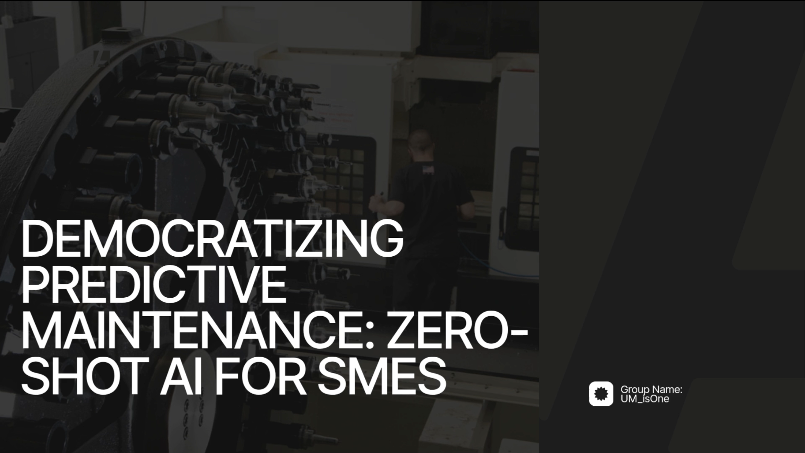

# Predictive Maintenance Platform (NASA C-MAPSS + VHACK Product)

This project is built to be **auditable by judges**: every major modeling choice is demonstrated in notebooks, metrics are reported from saved outputs, and deployment artifacts are explicitly linked to backend/frontend usage.

## Executive Summary

- Problem: Predict Remaining Useful Life (RUL) and machine health state for industrial assets.
- Approach: Sequence modeling (LSTM / CNN-BiLSTM), domain adaptation (DANN), and explainability (SHAP).
- Evidence: Notebook-driven experiments with exported artifacts used directly by APIs and apps.
- Productization: `vhack/` for backend + frontend user workflows.

---

## Demo Video

Project walkthrough video (Google Drive):

[](https://drive.google.com/file/d/1ABv0yOuryiVBOLzQPcQrM2AfAoVJYtKs/view?usp=sharing)

- Direct link: https://drive.google.com/file/d/1ABv0yOuryiVBOLzQPcQrM2AfAoVJYtKs/view?usp=sharing

---

## 1) System Architecture

```text
Raw data (data/raw) + external target data (AI4I)
            │
            ▼
Notebook pipeline (notebooks/01..09) + core modules (src/)
            │  - preprocess / window / train / evaluate / explain / export
            ▼
Artifacts (models/saved, data/processed, artifacts)
            │
     ┌──────┴─────────────┐
     ▼                    ▼
FastAPI runtime (api/)    VHACK application (vhack/backend + vhack/frontend)
```

### Architecture 1


- The proposed system architecture represents a comprehensive **Prescriptive Maintenance Ecosystem** designed specifically to bridge the gap between complex Artificial Intelligence and day-to-day industrial operations. Rather than simply providing a raw data point, this framework establishes a structured, multi-tier decision-making pipeline that translates high-level sensor analytics into concrete financial and technical actions. By integrating the entire lifecycle—from initial failure prediction to the final technician feedback loop—the system ensures that AI insights are never lost in translation but are instead converted into measurable business value for the enterprise.

### Phase 1: Data Mastery and the Predictive Core (Steps 1–2)
The foundation of our system is a robust data strategy designed to handle the messy reality of industrial environments. In Step 1: Remaining Useful Life (RUL) Prediction, our system ingests high-frequency multivariate time-series data, including vibration, temperature, and load sensors. Recognizing that real-world sensor data is often riddled with noise and missing values, our ml_service.py utilizes advanced preprocessing techniques—including sliding-window normalization and temporal feature engineering—to extract meaningful degradation patterns.

Our model doesn't just output a number; in Step 2: Failure Window Conversion, we translate raw cycles into a tangible "Failure Window." By calculating the number of days until a projected breakdown and adding a prediction confidence interval, we provide factory managers with a clear, non-technical timeline for intervention. This approach addresses the technical challenge of anomaly change-point detection, identifying the exact moment a machine transitions from a "Healthy" state to an "Impaired" state, which is critical for preventing sudden failures.


### Phase 2: The Reasoning Engine and RAG Intelligence (Steps 3–4)
Technical metrics alone are insufficient to gain the trust of factory operators. In Step 3: Root Cause Reasoning, we utilize **Google Gemini 2.5 Flash Lite** to perform deep-tier analysis. The system doesn't just say a machine is failing; it explains why. By mapping anomaly signals to specific component issues—such as identifying that high-frequency vibration harmonics correlate with bearing fatigue—the LLM provides actionable insights that bridge the gap between data science and mechanical engineering.

This reasoning is grounded in reality through our sophisticated RAG pipeline. In Step 4: Financial and Operational Risk Analysis, our rag_service.py queries a Supabase Vector Database populated with the SME’s own technical manuals and financial reports. Using LangChain and Google Generative AI Embeddings, the system extracts precise variables to calculate the Total Business Impact (TBI). We don't use generic estimates; we apply an Executive Standard formula: **TBI** = [(Lost Sales Opportunity + Total Burn Rate) × MTTR × Criticality Multiplier] + Recovery Costs. This level of detail transforms a maintenance alert into a financial priority, showing a manager that ignoring a "Yellow" status today will result in a $12,000 loss tomorrow.


### Phase 3: Executive Decision Support (Steps 5–6)
The Step 5: Management Report is delivered through a high-performance Streamlit dashboard, designed for maximum clarity. The Overview Page uses an intuitive Red/Yellow/Green indicator system, but the true power lies beneath the surface. When a machine enters a critical state, the manager is presented with Step 6A: Recommendation Planning.

Our AI doesn't just offer one solution; it generates three distinct maintenance strategies:

Time Priority: Focusing on the lowest Mean Time To Repair (MTTR) to minimize immediate downtime.
Cost Priority: Prioritizing the lowest material and labor expenses.
Labor/Reliability Priority: Focusing on long-term stability and comprehensive machine health.

This leads to Step 6B: Management Decision, where the user can approve, delay, or modify the plan based on the cost-vs-downtime risk presented. This interactive workflow demonstrates our mastery of system integration, connecting the AI’s output directly to the human decision-making process within the application pipeline.


### Phase 4: Operationalizing the Insight (Steps 7–9)
Once a strategy is approved, the system transitions from strategy to execution. In Step 7: Generate Technical Instructions, the reasoning_service.py synthesizes information from the technical manuals to provide the technician with detailed, grounded steps, required components (e.g., NSK-6205 Bearings), and estimated repair times. This eliminates the "discovery time" usually wasted when a technician first arrives at a machine.

The Step 8: Maintenance Platform serves as the hub for ongoing operations. It handles maintenance scheduling and sends automated notifications to available technicians. In Step 9: Technician Report, the on-ground staff follows a digital inspection checklist and logs the repair outcome directly into the system. This modular approach ensures that our code is not just a pilot-phase script but a production-ready tool capable of handling the full lifecycle of an industrial work order.


### Phase 5: The Continuous Improvement Loop (Step 10)
The final, and perhaps most critical, stage is the Step 10: Technician Feedback Loop. The actual cause of failure and the results of the repair are logged and fed back into the ml_service.py. This data is used to retrain the ML model and refine the LLM’s reasoning prompts, ensuring that the system becomes more accurate with every intervention.

From a code quality perspective, our architecture is built for scalability. By using FastAPI for the backend, we ensure asynchronous efficiency, while Supabase handles both relational data and high-dimensional vectors in a single, scalable cloud environment. Our use of Gemini-2.5-Flash-Lite demonstrates a deep consideration for computational efficiency, providing high-order reasoning at a latency and cost profile that is feasible for SMEs with limited IT budgets.

### Conclusion: A Future of Resilient Industry
In conclusion, our solution demonstrates mastery across the entire AI stack. We have moved beyond simple regression modeling to create a comprehensive business tool that speaks the language of both the technician and the CEO. By handling real-world noise, providing transparent financial reasoning, and integrating a seamless feedback loop, we have built a platform that doesn't just predict failure—it prevents economic loss. This is more than a hackathon prototype; it is a modular, production-ready blueprint for the future of ASEAN’s industrial resilience, ensuring that every SME has the AI-driven "Smart Factory" capabilities they need to thrive in the global market.


### Architecture for model pipeline 


- This flowchart outlines an Adversarial Domain Adaptation (ADA) Pipeline designed for industrial Remaining Useful Life (RUL) prediction. It specifically focuses on "Zero-Shot" adaptationapplying a model trained on known datasets (NASA C-MAPSS) to a completely new target environment (AI4I 2020 Factory Data).
Here is a brief breakdown of the architecture:
### 1. Data & Preprocessing
Sources: It uses NASA’s FD001 and FD003 datasets as "source domains" and AI4I 2020 CNC milling data as the "target domain."
Techniques: Data is cleaned via Winsorization and Savitzky-Golay smoothing. It employs unit-based train/val splitting to ensure no data leakage between engine units.

### 2. Model Architecture
Deep Backbone: A hybrid CNN-BiLSTM network serves as the feature extractor.
Domain Adaptation (DANN):
A Shared Encoder extracts features common to both factory and NASA data.
A Gradient Reversal Layer (GRL) and Domain Discriminator work together to ensure the features are "domain-invariant" (meaning the model can't tell which dataset the data came from, making it more robust).
Target Adapter: A lightweight (145 parameters) modular component specifically helps align the model to the new factory environment.

### 3. Training Strategy
Phased Approach: Training starts with the backbone, followed by a "DANN Phase" where adversarial training stabilizes the encoder against domain shifts.
Health Indicator (HI): The pipeline calculates a composite HI (monotonicity, trendability, and robustness) to validate the quality of the degradation signals.

---

## 3) Tech Stack

- Language: Python
- Data/ML: NumPy, Pandas, SciPy, scikit-learn, TensorFlow/Keras, SHAP, Ruptures
- Visualization: Matplotlib, Seaborn, Plotly
- Serving: FastAPI, Uvicorn, Pydantic
- UI/Product: Streamlit (`app.py`, `vhack/streamlit_app.py`)
- Persistence: Joblib, `.keras`, `.weights.h5`, `.npy`
- Environment: `venv`, pip
- LLM Api key usage: Gemini 2.5 flash lite (Root Cause Reasoning)
- Supabase Vector Database: populated with the SME’s own technical manuals and financial reports
- LangChain: Acts as the orchestration framework for the RAG (Retrieval-Augmented Generation) pipeline. it connects the vector database to the Gemini LLM, allowing the system to "ground" its reasoning in specific SME technical documents.

---

## 4) Technical Architecture

Your system is intentionally split into **two connected tracks**:

### A) Primary System (Production App) — `vhack/`

This is the main end-to-end platform used by users and judges.

- `vhack/backend/`: FastAPI backend (`main.py`) with auth, machine, resource, and maintenance routers.
- `vhack/frontend/` + `vhack/pages/`: Streamlit UI flows for operations, risk, and maintenance workflows.
- `vhack/services/`: orchestration logic (prediction integration, reasoning, explainability, replay/simulation, database access).
- `vhack/streamlit_app.py` / `vhack/app.py`: app entry points for user-facing interaction.

### B) Model R&D and Training Pipeline — `notebooks/` + `src/`

This is the experimentation and model-building layer.

- `notebooks/01..09`: full lifecycle from EDA → preprocessing → training → adaptation → evaluation → export.
- `src/`: reusable ML code for loading, preprocessing, windowing, model building, training, evaluation, explainability, and adaptation.
- Outputs are saved as artifacts (`.weights.h5`, `.keras`, `.joblib`, `.npy`) for runtime consumption.

### C) Optional Serving Layer (Research/Standalone API) — `api/`

- `api/` exposes standalone inference/adaptation endpoints (`/predict`, `/adapt`, `/predict/adapted`).
- Useful for direct model serving and testing outside the full VHACK product flow.

### D) Integration Contract (How both tracks connect)

- Training track (`notebooks/` + `src/`) produces versioned model artifacts.
- Production track (`vhack/`) consumes those artifacts via backend services and exposes them through user workflows.
- This separation keeps experimentation flexible while keeping the product layer stable and deployment-ready.

---

## 5) Notebook-by-Notebook Methodology, Model Choice, and Usage

### Notebook 01 — `notebooks/01_data_exploration.ipynb`

**Concept used**
- Exploratory data analysis on C-MAPSS regimes and sensor distributions.

**Why this model/data decision**
- Confirms feature availability and behavior before model design.

**Usage in pipeline**
- Drives preprocessing assumptions used in Notebook 02.

---

### Notebook 02 — `notebooks/02_preprocessing_noise_handling.ipynb`

**Concept used**
- Savitzky-Golay smoothing, imputation, min-max scaling, and window-ready preparation.

**Why this decision**
- Sequence models are sensitive to noise/missing values and scale inconsistencies.

**Usage in pipeline**
- Produces normalized inputs for training/evaluation notebooks and runtime consistency.

---

### Notebook 03 — `notebooks/03_changepoint_anomaly_detection.ipynb`

**Concept used**
- CUSUM-like transition detection for health-state shift detection.

**Why this decision**
- RUL value alone is not enough for operations; state transitions improve actionability.

**Usage in pipeline**
- Health-state logic and transition cues feed explanation layer and API outputs.

---

### Notebook 04 — `notebooks/04_baseline_lstm_rul.ipynb`

**Concept/model used**
- Baseline temporal models including pure LSTM and CNN-BiLSTM variants.

**Why this decision**
- Establishes a strong in-domain benchmark before adaptation.

**Usage in pipeline**
- Produces baseline weights consumed by Notebook 06 and export/deployment paths.

---

### Notebook 05 — `notebooks/05_lstm_dann_domain_adaptation.ipynb`

**Concept/model used**
- DANN (Domain-Adversarial Neural Network) with feature-space alignment and adapter.

**Why this decision**
- Addresses domain shift (FD001 → AI4I) where source-only models degrade.

**Usage in pipeline**
- Produces adapted weights/scalers/adapter artifacts used in Notebook 06 and serving.

---

### Notebook 06 — `notebooks/06_model_evaluation_comparison.ipynb`

**Concept/model used**
- Controlled comparison across:
  - Pure LSTM (source-only)
  - CNN-BiLSTM (source-only)
  - CNN-LSTM-DANN (adapted)
- Uses RMSE, MAE, NASA score, and HI quality metrics.

**Why this decision**
- Provides judge-friendly evidence that adaptation improves transfer performance.

**Metrics obtained (from saved Notebook 06 outputs)**

1) **FD001 In-domain**
- Pure LSTM (FD001): RMSE **34.96**, MAE **26.93**, NASA **3239**
- CNN-LSTM / CNN-BiLSTM (FD001): RMSE **18.85**, MAE **15.30**, NASA **566**

2) **Cross-domain FD001 → AI4I (full lifecycle windows)**
- LSTM Source-Only: RMSE **33.23**
- CNN-LSTM Source-Only: RMSE **30.59**
- CNN-LSTM-DANN (Adapted): RMSE **23.94**

3) **Health Indicator quality (FD001 train lifecycle)**
- Monotonicity: **0.7204**
- Trendability: **0.9513**
- Robustness: **0.6792**
- Composite: **0.7837**

4) **Checklist status**
- Targets passed: **5 / 5**

**Usage in pipeline**
- This notebook is your primary evidence/reporting notebook for judges.

---

### Notebook 07 — `notebooks/07_interpretability.ipynb`

**Concept/model used**
- SHAP-style interpretation for feature contribution analysis.

**Why this decision**
- Improves trust and supports operator-facing reasoning.

**Usage in pipeline**
- Supports explainability narrative for deployment and judging clarity.

---

### Notebook 08 — `notebooks/08_model_export_fastapi.ipynb`

**Concept used**
- Packaging trained components into deployable artifacts.

**Why this decision**
- Bridges notebook experimentation to production API consumption.

**Usage in pipeline**
- Exports `pm_pipeline_*.joblib` and related assets used by `api/` and `vhack/` stack.

---

### Notebook 09 — `notebooks/09_mtda_multi_target_extension.ipynb`

**Concept/model used**
- Multi-target or extended transfer adaptation experiments.

**Why this decision**
- Tests scalability and generalization for future machine onboarding.

**Usage in pipeline**
- Forward-looking extension path for broader deployment scenarios.

---

## 6) Artifact Contract (Training → Runtime)

### Produced by notebooks / `src/`
- Model weights (`.keras`, `.weights.h5`)
- Pipeline bundles (`.joblib`)
- Alignment/scaling arrays (`.npy`)
- Processed datasets (`data/processed/`)

### Consumed by runtime
- `api/predictor.py`, `api/adapt.py`
- `vhack/backend/services/*`
- Frontend/operator flows through backend API endpoints

---

## 7) Project Structure

```text
.
├── notebooks/                     # Evidence and experiments (01..09)
├── src/                           # Reusable ML pipeline code
├── api/                           # FastAPI inference and adaptation endpoints
├── vhack/                         # Product backend + frontend + app entrypoints
├── data/                          # raw/ and processed/
├── models/saved/                  # exported deployable artifacts
├── artifacts/                     # experiment artifacts
├── app.py                         # root Streamlit workflow
├── requirements.txt
└── Dockerfile
```

---

## 8) Getting Started

### Local setup

```bash
python -m venv .venv
source .venv/bin/activate
python -m pip install --upgrade pip
pip install -r requirements.txt
```

### Data placement

Put C-MAPSS files under `data/raw/`:
- `train_FD001.txt` … `train_FD004.txt`
- `test_FD001.txt` … `test_FD004.txt`
- `RUL_FD001.txt` … `RUL_FD004.txt`

### Run notebook pipeline (recommended)

1. `notebooks/01_data_exploration.ipynb`
2. `notebooks/02_preprocessing_noise_handling.ipynb`
3. `notebooks/03_changepoint_anomaly_detection.ipynb`
4. `notebooks/04_baseline_lstm_rul.ipynb`
5. `notebooks/05_lstm_dann_domain_adaptation.ipynb`
6. `notebooks/06_model_evaluation_comparison.ipynb`
7. `notebooks/07_interpretability.ipynb`
8. `notebooks/08_model_export_fastapi.ipynb`
9. `notebooks/09_mtda_multi_target_extension.ipynb` (optional advanced)

### Run API

```bash
uvicorn api.main:app --host 0.0.0.0 --port 8000 --reload
```

## Run apps
### Run streamlit dashboard
```bash
cd vhack/frontend
uv pip install -r requirements.txt
uv run streamlit run app.py
```

### Run backend server
```bash
cd vhack/backend
uv pip install -r requirements.txt
uv run main.py
```

---

## 9) Environment Variables

- .env.example file in the backend folder and is required to fill in the google api key and rename it to .env

- can get it here: https://aistudio.google.com/api-keys

---

## 10) API Reference

- access API list in http://0.0.0.0:8000/docs after opened backend server for more API usage

---

## 11) Challenges Faced (and How Addressed)

Even with strong benchmark performance, moving from notebook results to a live factory environment introduces high-stakes engineering constraints.

- **Negative transfer and domain misalignment**: adaptation is not always monotonic; in exploratory MTDA runs, performance can degrade (for example, RMSE around 49.74), showing that “more universal” is not automatically “more accurate.” The main challenge is tuning the balance between a general backbone and machine-specific adaptation.
- **Sensor heterogeneity and mapping risk**: the shared feature strategy is powerful, but real SMEs have very different sensor counts, sampling rates, and physical units. Preserving signal meaning while mapping a 2-sensor legacy machine and a 15-sensor modern machine into a common inference space remains a core integration challenge.
- **Trust gap in health indicators**: early HI behavior can be noisy (including near-zero monotonicity before fixes). Even with smoothing and lifecycle-aware evaluation, real plant noise is harsher than simulated datasets, so interpretability and stability must be continuously reinforced for operator trust.
- **Edge deployment constraints**: the adapter is lightweight, but the full temporal backbone is still computationally heavy for low-cost edge devices. Compression/quantization is required to achieve practical latency and cost targets without giving up adaptation gains.
- **Data realism gap**: static benchmark datasets do not represent full production variability (maintenance behavior, sensor drift, missingness patterns, operator actions), so robustness must be proven under evolving real-world conditions.

---

## 12) Future Roadmap

The roadmap aims to scale for ASEAN industrial resilience
The evolution of our platform focuses on moving from a centralized, single-source AI to a decentralized, multi-sensory intelligence ecosystem. By prioritizing the following three pillars, the system moves beyond basic Remaining Useful Life (RUL) estimation into a "self-aware" industrial asset capable of delivering high-speed, high-precision manufacturing intelligence.

### Multimodal Expansion: The 360-Degree Health View

The current reliance on vibration and temperature provides a strong baseline, but true mechanical "intuition" requires a broader sensory input. Our roadmap introduces Acoustic Emissions and Electrical Current Telemetry to the feature space. While vibration monitors physical displacement, acoustic sensors can detect the "micro-cracks" and high-frequency stress waves that occur long before a visible shake begins. Simultaneously, monitoring the Current Signature of a motor allows the model to detect internal electrical imbalances or increased resistance due to friction. By fusing these diverse data streams, the model gains a holistic view, significantly reducing the probability of a "blind-spot" failure.

### Edge Deployment: Real-Time Intelligence via NVIDIA Jetson

To meet the demands of the modern factory floor, the architecture is moving away from cloud-dependent inference toward Local Edge Deployment. By porting the CNN-BiLSTM backbone and its modular adapters to NVIDIA Jetson gateways, the system eliminates the risks associated with cloud latency and intermittent internet connectivity. This "Edge-First" approach ensures that critical failure alerts are triggered in milliseconds, allowing for automated emergency stops that can save thousands of dollars in hardware damage. Furthermore, keeping data processing local addresses the strict data privacy and security concerns often held by specialized SME manufacturers.

### Test-Time Adaptation: Autonomous Real-Time Self-Alignment

One of the most innovative technical milestones in the roadmap is the transition to Test-Time Adaptation (TTA). In a typical deployment, a model is "frozen" once it leaves the laboratory; however, factory conditions—such as ambient humidity or varying load types—are constantly shifting. TTA allows the model to autonomously self-align its internal weights as it processes streaming data without requiring a manual retraining phase. This means the model "learns" the specific quirks of a machine while it is running, ensuring that the 28.81 RMSE baseline actually improves over time as the AI stabilizes itself against the unique environmental noise of the specific shop floor.

### Strategic Impact: A Resilient Industrial Standard

Together, these updates transform the project from a localized tool into a Universal Industrial Standard. Multimodal inputs provide the "eyes and ears," Edge deployment provides the "reflexes," and Test-Time Adaptation provides the "evolving brain." For a third-party investor or stakeholder, this roadmap represents a clear path toward a zero-configuration, "set-and-forget" solution. It addresses the core technical challenges of industrial AI—data variety, speed, and environmental drift—positioning the platform as a leader in the next generation of ASEAN industrial resilience.

### Summary

One of this project’s practical advantage is **Day-One operational value**: it delivers immediate predictive capability with a clear path to adapt, validate, and scale. The central strategic objective is to convert domain adaptation from a one-off technical fix into a resilient industrial learning loop across entire SME fleets.

---

## 13) License

This project is licensed under the Apache License 2.0.
See [LICENSE](LICENSE) for the full text.
